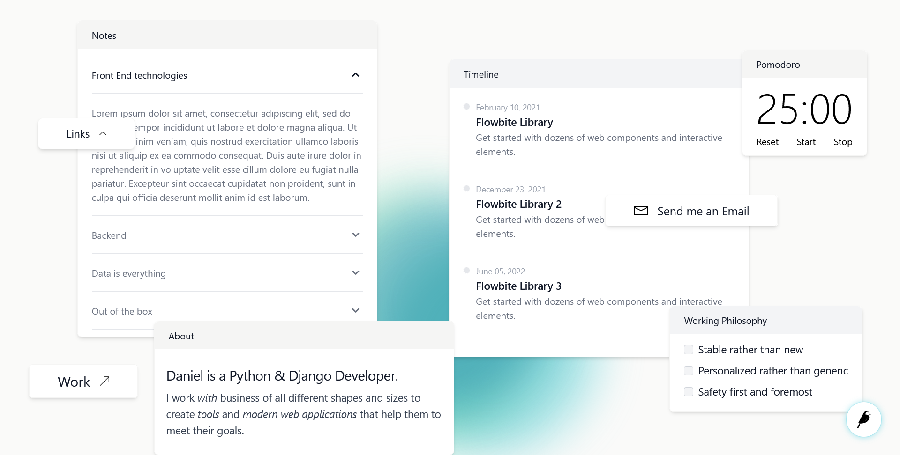

# Artifica - A personal OS-like portfolio.

> Artifica is a work in progress and a personal project.

Artifica is a personal web portfolio designed as a personal OS following the [Fluent Design System](https://www.microsoft.com/design/fluent/) made by Microsoft for the Windows operating system. It was inspired by the awesome [MAD](https://mad.ac/) Studio's page. I use Django & [Wagtail](https://wagtail.org/) along with Redis & PostgreSQL for the backend and [Tailwind CSS](https://tailwindcss.com/) for the frontend.

